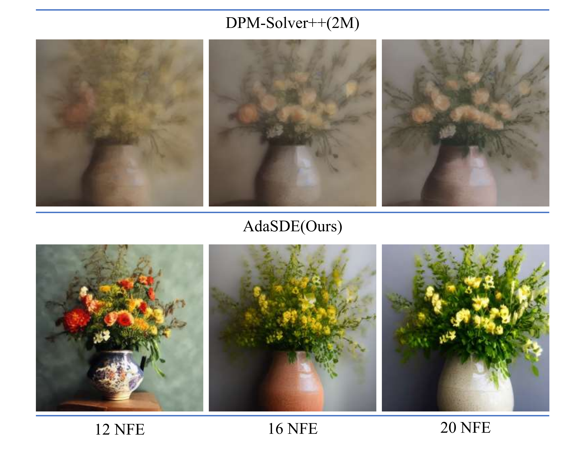
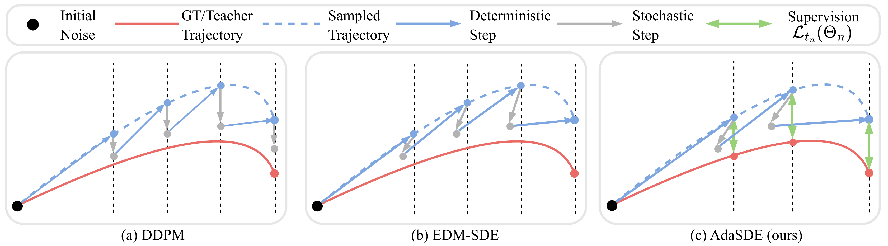

## [NeurIPS 2025] Adaptive Stochastic Coefficients for Accelerating Diffusion Sampling<br><sub>Official implementation of the NeurIPS 2025 paper</sub>

<div align="center">

</div>

<div align="center">

<a href="https://arxiv.org/pdf/2510.23285" style="display: inline-block;">
    
</a>&nbsp;

</div>

**Abstract**: Diffusion-based generative processes, formulated as differential equation solving, frequently balance computational speed with sample quality. Our theoretical investigation of ODE- and SDE-based solvers reveals complementary weaknesses: ODE solvers accumulate irreducible gradient error along deterministic trajectories, while SDE methods suffer from amplified discretization errors when the step budget is limited. Building upon this insight, we introduce AdaSDE, a novel single-step SDE solver that aims to unify the efficiency of ODEs with the error resilience of SDEs. Specifically, we introduce a single per-step learnable coefficient, estimated via lightweight distillation, which dynamically regulates the error correction strength to accelerate diffusion sampling. Notably, our framework can be integrated with existing solvers to enhance their capabilities. Extensive experiments demonstrate
state-of-the-art performance: at 5 NFE, AdaSDE achieves FID scores of 4.18 on CIFAR-10, 8.05 on FFHQ and 6.96 on LSUN Bedroom.



## Requirements
- This codebase mainly refers to the codebase of [EDM](https://github.com/NVlabs/edm). To install the required packages, please refer to the [EDM](https://github.com/NVlabs/edm) codebase.
- This codebase supports the pre-trained diffusion models from [EDM](https://github.com/NVlabs/edm), [ADM](https://github.com/openai/guided-diffusion), [Consistency models](https://github.com/openai/consistency_models), [LDM](https://github.com/CompVis/latent-diffusion) and [Stable Diffusion](https://github.com/CompVis/stable-diffusion). When you want to load the pre-trained diffusion models from these codebases, please refer to the corresponding codebases for package installation.

## Getting Started

## Adasde Implementation Guide

- Run the commands in [launch.sh](./launch.sh) for training, sampling and evaluation using our recommended configurations. 
- All commands support multi-GPU parallelization by adjusting the `--nproc_per_node` parameter. 
- Complete parameter descriptions are available in the next section.

### Setup Notes:
- Required models will be automatically downloaded to `"./src/dataset_name"`
- Default configurations use 2 4090GPU for CIFAR10, FFHQ, ImageNet, and 4 A100 GPUs for LSUN Bedroom and Stable Diffusion
- Adjust batch size according to your hardware capabilities

**Important Note**:  
The `num_steps` parameter specifies the number of original timestamps. Adasde inserts new timestamps between existing ones, so:
- When `num_steps=4`, the total becomes 7 timestamps (6 sampling steps)
- NFE = 5 if `afs==True`, otherwise 6

### Example Commands:

```bash
# Adasde Configuration
SOLVER_FLAGS="--sampler_stu=adasde --sampler_tea=dpm --num_steps=3 --M=3 --afs=True --scale_dir=0.05 --scale_time=0.2 --gamma=0.02 --seed=0 --lr=0.2 --coslr"
SCHEDULE_FLAGS="--schedule_type=time_uniform --schedule_rho=1"
torchrun --standalone --nproc_per_node=2 --master_port=11111 \
train.py --dataset_name="cifar10" --batch=32 --total_kimg=10 $SOLVER_FLAGS $SCHEDULE_FLAGS
```
```bash
# Stable Diffusion
SOLVER_FLAGS="--sampler_stu=adasde --sampler_tea=dpm --num_steps=4 --M=3 --afs=True --scale_dir=0.05 --scale_time=0.2 --seed=0 --lr 0.01"
SCHEDULE_FLAGS="--schedule_type=discrete --schedule_rho=1"
ADDITIONAL_FLAGS="--max_order=2 --predict_x0=False --lower_order_final=True"
GUIDANCE_FLAGS="--guidance_type=cfg --guidance_rate=7.5"
torchrun --standalone --nproc_per_node=4 --master_port=11111 \
train.py --dataset_name="ms_coco" --batch=32 --total_kimg=5 $SOLVER_FLAGS $SCHEDULE_FLAGS $ADDITIONAL_FLAGS $GUIDANCE_FLAGS
```

```bash
# Generate 50K samples for FID evaluation
torchrun --standalone --nproc_per_node=1 --master_port=22222 \
sample.py --predictor_path=0 --batch=128 --seeds="0-49999"
```

The generated images will be stored at ```"./samples"``` by default. To compute Fréchet inception distance (FID) for a given model and sampler, compare the generated 50k images against the dataset reference statistics using ```fid.py```:

```.bash
# FID evaluation
python fid.py calc --images=path/to/images --ref=path/to/fid/stat
```


## Parameter Description

| Category          | Parameter          | Default | Description |
|-------------------|--------------------|---------|-------------|
| **General Options** | `dataset_name`     | None    | Supported datasets: `['cifar10', 'ffhq', 'afhqv2', 'imagenet64', 'lsun_bedroom', 'imagenet256', 'lsun_bedroom_ldm', 'ms_coco']` |
|                   | `predictor_path`   | None    | Path or experiment number of trained AdaSDE predictor |
|                   | `batch`            | 64      | Total batch size |
|                   | `seeds`            | "0-63"  | Random seed range for image generation |
|                   | `grid`             | False   | Organize output images in grid layout |
|                   | `total_kimg`       | 10      | Training duration (in thousands of images) |
|                   | `scale_dir`        | 0.05    | Gradient direction scale (`c_n` in paper). Range: `[1-scale_dir, 1+scale_dir]` |
|                   | `scale_time`       | 0.2       | Input time scale (`a_n` in paper). Range: `[1-scale_time, 1+scale_time]` |
| **Solver Flags**  | `sampler_stu`      | 'adasde'   | Student solver: `['adasde']` |
|                   | `sampler_tea`      | 'dpm'   | Teacher solver type |
|                   | `num_steps`        | 4       | Initial timestamps for student solver. Final steps = `2*(num_steps-1)`  |
|                   | `M`                | 3       | Intermediate steps inserted between teacher solver steps |
|                   | `afs`              | True   | Enable Accelerated First Step (saves initial model evaluation) |
| **Schedule Flags**| `schedule_type`    | 'polynomial' | Time discretization: `['polynomial', 'logsnr', 'time_uniform', 'discrete']` |
|                   | `schedule_rho`     | 7       | Time step exponent (required for `polynomial`, `time_uniform`, `discrete`) |
| **Additional Flags** | `predict_x0`       | True    | DPM-Solver++: Use data prediction formulation |
|                   | `lower_order_final`| True    | DPM-Solver++: Reduce order at final sampling stages |
| **Guidance Flags** | `guidance_type`    | None    | Guidance method: `['cg' (classifier), 'cfg' (classifier-free), 'uncond' (unconditional), None]` |
|                   | `guidance_rate`    | None    | Guidance strength parameter |
|                   | `prompt`           | None    | Text prompt for Stable Diffusion sampling |


## 🚀 Performance Highlights


**Key Metric:** All numbers are measured at **5 NFE** (ultra-low latency).  
At equal NFE, **AdaSDE** consistently achieves the best FID and outperforms the best non-AdaSDE method on every dataset.

| Dataset                 | AdaSDE @5 NFE (FID ↓) | Best non-AdaSDE (method) | FID ↓ | Absolute gain (ΔFID) | Relative gain |
|-------------------------|-----------------------|---------------------------|-------|----------------------|---------------|
| CIFAR-10 (32×32)       | **4.18**              | AMED-Solver               | 7.59  | −3.41               | **−44.9%**    |
| FFHQ-64                | **8.05**              | AMED-Solver               | 14.80 | −6.75               | **−45.6%**    |
| ImageNet-64            | **6.90**              | AMED-Solver               | 10.74 | −3.84               | **−35.8%**    |
| LSUN Bedroom (256×256) | **6.96**              | AMED-Solver               | 13.20 | −6.24               | **−47.3%**    |


## Pre-trained AdaSDE Predictors

We provide pre-trained AdaSDE predictors for:

- CIFAR-10 main result
- CIFAR-10 ablation result


The pre-trained models are available in `./exp/`.

**Folder naming format:**
`<exp_num>-<dataset_name>-<num_steps>-<NFE>-<student>-<schedule>-<afs>`

**Usage:**

Run sampling with:

```bash
# Generate 50K samples for FID evaluation
torchrun --standalone --nproc_per_node=1 --master_port=22222 \
sample.py --predictor_path=EXP_NUM --batch=128 --seeds="0-49999"
```

## Pre-trained Diffusion Models
We perform sampling on a variaty of pre-trained diffusion models from different codebases including
[EDM](https://github.com/NVlabs/edm), [ADM](https://github.com/openai/guided-diffusion), [Consistency models](https://github.com/openai/consistency_models), [LDM](https://github.com/CompVis/latent-diffusion) and [Stable Diffusion](https://github.com/CompVis/stable-diffusion). The tested pre-trained models are listed below:

| Codebase | dataset_name | Resolusion | Pre-trained Models | Description |
|----------|---------|------------|--------------------|-------------|
|EDM|cifar10|32|[edm-cifar10-32x32-uncond-vp.pkl](https://nvlabs-fi-cdn.nvidia.com/edm/pretrained/edm-cifar10-32x32-uncond-vp.pkl)
|EDM|ffhq|64|[edm-ffhq-64x64-uncond-vp.pkl](https://nvlabs-fi-cdn.nvidia.com/edm/pretrained/edm-ffhq-64x64-uncond-vp.pkl)
|EDM|afhqv2|64|[edm-afhqv2-64x64-uncond-vp.pkl](https://nvlabs-fi-cdn.nvidia.com/edm/pretrained/edm-afhqv2-64x64-uncond-vp.pkl)
|EDM|imagenet64|64|[edm-imagenet-64x64-cond-adm.pkl](https://nvlabs-fi-cdn.nvidia.com/edm/pretrained/edm-imagenet-64x64-cond-adm.pkl)
|Consistency Models|lsun_bedroom|256|[edm_bedroom256_ema.pt](https://openaipublic.blob.core.windows.net/consistency/edm_bedroom256_ema.pt)|Pixel-space
|ADM|imagenet256|256|[256x256_diffusion.pt](https://openaipublic.blob.core.windows.net/diffusion/jul-2021/256x256_diffusion.pt) and [256x256_classifier.pt](https://openaipublic.blob.core.windows.net/diffusion/jul-2021/256x256_classifier.pt)|Classifier-guidance.
|LDM|lsun_bedroom_ldm|256|[lsun_bedrooms.zip](https://ommer-lab.com/files/latent-diffusion/lsun_bedrooms.zip)|Latent-space
|Stable Diffusion|ms_coco|512|[stable-diffusion-v1-5](https://huggingface.co/runwayml/stable-diffusion-v1-5/resolve/main/v1-5-pruned-emaonly.ckpt)|Classifier-free-guidance


## FID Statistics
For facilitating the FID evaluation of diffusion models, we provide our [FID statistics](https://drive.google.com/drive/folders/1f8qf5qtUewCdDrkExK_Tk5-qC-fNPKpL?usp=sharing) of various datasets. They are collected on the Internet or made by ourselves with the guidance of the [EDM](https://github.com/NVlabs/edm) codebase. 

You can compute the reference statistics for your own datasets as follows:

```
python fid.py ref --data=path/to/my-dataset.zip --dest=path/to/save/my-dataset.npz
```

## Citation
If you find this repository useful, please consider citing the following paper:

```
@inproceedings{wang2025adaptivestochasticcoefficientsaccelerating,
      title={Adaptive Stochastic Coefficients for Accelerating Diffusion Sampling}, 
      author={Ruoyu Wang and Beier Zhu and Junzhi Li and Liangyu Yuan and Chi Zhang},
      year={2025},
      booktitle={Proc. NeurIPS}
     
}
}
```
